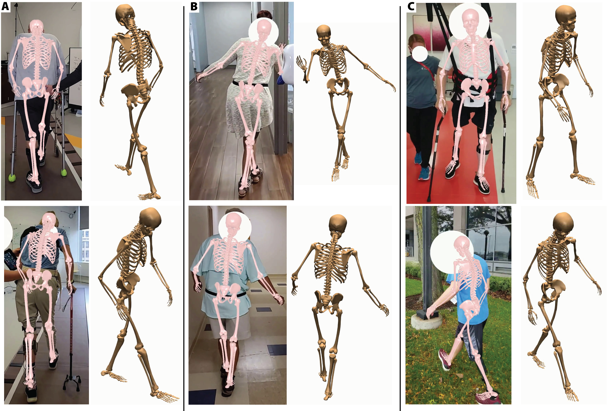

<div align="center">

# Portable Biomechanics Laboratory: Clinically Accessible Movement Analysis from a Handheld Smartphone

[J.D. Peiffer](https://www.sralab.org/researchers/jd-peiffer)<sup>1,2</sup>, Kunal Shah<sup>1</sup>, Irina Djuraskovic<sup>1,3</sup>, Shawana Anarwala<sup>1</sup>, Kayan Abdou<sup>1</sup>, Rujvee Patel<sup>4</sup>, Prakash Jayabalan<sup>1,5</sup>, Brenton Pennicooke<sup>4</sup>, R. James Cotton<sup>1,5</sup>

<sup>1</sup>Center for Bionic Medicine, Shirley Ryan AbilityLab, Chicago, IL<br>
<sup>2</sup>Dept of Biomedical Engineering, Northwestern University, Evanston, IL<br>
<sup>3</sup>Interdepartmental Neuroscience, Northwestern University, Chicago, IL<br>
<sup>4</sup>Department of Neurological Surgery, Washington University School of Medicine, St. Louis, MO, USA<br>
<sup>5</sup>Department of Physical Medicine and Rehabilitation, Northwestern University Feinberg School of Medicine, Chicago, IL, USA<br>

</div>


> This repository includes code and a gradio demo for running the single camera (monocular) biomechanical fitting code from smartphone videos.

# Abstract
The way a person moves is a direct reflection of their neurological and musculoskeletal health, yet it remains one of the most underutilized vital signs in clinical practice. Although clinicians visually observe movement impairments, they lack accessible and validated methods to objectively measure movement in routine care. This gap prevents wider use of biomechanical measurements in practice, which could enable more sensitive outcome measures or earlier identification of impairment.

In this work, we present our Portable Biomechanics Laboratory (PBL), which includes a secure, cloud-enabled smartphone app for data collection and a novel algorithm for fitting biomechanical models to this data. We extensively validated PBL’s biomechanical measures using a large, clinically representative and heterogeneous dataset with synchronous ground truth. Next, we tested the usability and utility of our system in both a neurosurgery and sports medicine clinic.

We found joint angle errors within 3 degrees and pelvis translation errors within several centimeters across participants with neurological injury, lower-limb prosthesis users, pediatric inpatients and controls. In addition to being easy and quick to use, gait metrics computed from the PBL showed high reliability (ICCs > 0.9) and were sensitive to clinical differences. For example, in individuals undergoing decompression surgery for cervical myelopathy, the modified Japanese Orthopedic Association (mJOA) score is a common patient-reported outcome measure; we found that PBL gait metrics not only correlated with mJOA scores but also demonstrated greater responsiveness to surgical intervention than the patient-reported outcomes.

These findings support the use of handheld smartphone video as a scalable, low-burden, tool for capturing clinically meaningful biomechanical data, offering a promising path toward remote, accessible monitoring of mobility impairments in clinical populations. To promote further research and clinical translation, we open-source the first method for measuring whole-body kinematics from handheld smartphone video validated in clinical populations: [https://github.com/IntelligentSensingAndRehabilitation/MonocularBiomechanics](https://github.com/IntelligentSensingAndRehabilitation/MonocularBiomechanics)

# Code
Clone and install
```
git clone git@github.com:IntelligentSensingAndRehabilitation/MonocularBiomechanics.git
cd MonocularBiomechanics/
pip install -e .
```
## Gradio demo
```
python main.py
```
A local webpage will open to upload and run the code.

# Jupyter Notebook
A jupyter notebook with steps to run the pipeline can be found [here](https://github.com/IntelligentSensingAndRehabilitation/MonocularBiomechanics/blob/main/monocular-demo.ipynb).

# Citation
Preprint coming soon.
```bibtex
@inproceedings{tba,
  title={{tba}},
  author={tba},
  booktitle={tba},
  year={2025}
}
```
